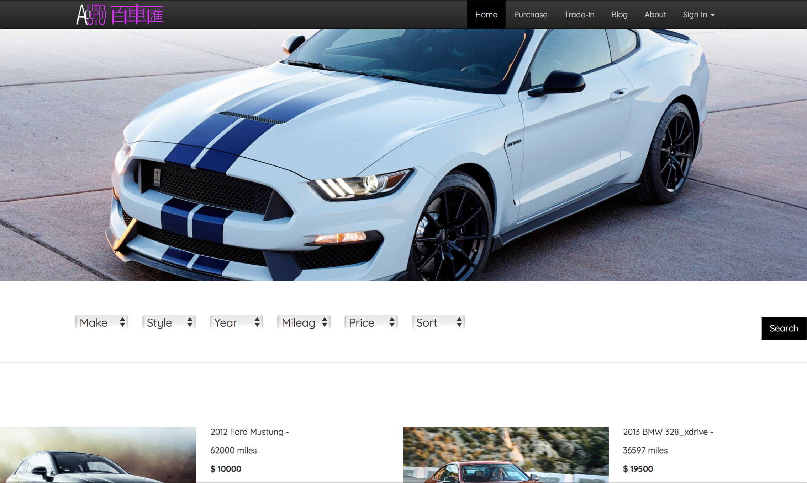

# NY Automotive Dealership Website and Data Management

## Introduction
New York Auto Depot, Inc. is an entrepreneurial automotive dealership founded in 2012 by a group of college graduates who are also automotive enthusiasts. The company aims to provide personalized vehicle purchase consultation for college students at a lower price than traditional dealerships by making use of e-business technologies and new media platforms. It also connects car enthusiasts in various colleges and create a network of people who love or hope to learn about cars.

This website project includes:
- Client Side Interfaces: browsing and selling vehicles on desktop and mobile devices for customers.
- Data Management System: admin portal and different levels of access to vehicle data for employees.



## Requirements
- Linux OS
- Python 2.7
- Django
- Django Rest Framework
- Webpack
- React for Javascript

## Deploy and Run
- `cd` to the folder you want to place this project and clone this repo:
  ```
  git clone https://github.com/xuqiantong/NY_Auto.git
  ```
- `cd` to the `NY_Auto/web` folder which includes all the sorce codes.
- Install pip and npm:
  ```
  apt-get install python-pip
  apt-get install npm
  ```
- Install Dependencies:
  ```
  npm install

  pip install Django
  pip install djangorestframework
  pip install markdown
  pip install django-filter 
  pip install django-webpack-loader
  ```
  See https://docs.djangoproject.com/en/1.11/topics/install/ for more details.
- Complie front-end renders:
  ```
  ./node_modules/.bin/webpack --config webpack.config.js
  ```
- Run Django server:
  ```
  python manage.py runserver
  ```
  If the server is successfully running, you should see somthing like this:
  ```
  Performing system checks...

  System check identified no issues (0 silenced).
  May 17, 2017 - 18:00:51
  Django version 1.9.4, using settings 'mysite.settings'
  Starting development server at http://127.0.0.1:8000/
  Quit the server with CONTROL-C.
  ```
  Then you can have a look at the homepage at http://127.0.0.1:8000/home.

## Administraion System Instruction
- Log in as the administrator at http://127.0.0.1:8000/admin. All the five tables are listed in the `DATA_BASE` section.
- The administrator has the the ability to view, add, delete, and modify any data entry in any table.
- Information about all the original vehicles and customers are already loaded into the database.
- If someone want to sell a vehicle, contact information about the seller will be stored in `Customers` and information about the new vehicle will be stored in `Vehicles` as a new entry. Once any employee has checked and validated that vehicle's information, the administrator can simply check the `valid` field of the vehicle, so that it is ready to be shown on the website.
- `Has_images`, `Sells`, `Favorites` are three relational tables, which use foreign keys to connect with `Vehicles` and `Customers`, two entity tables. If you remove an entry in `Vehicles` or `Customer`, all the information related to that entry will be automatically deleted as well. For example, if you delete a customer, all the information like vehicles s/he liked or vehicles s/he sold will also be deleted. 
- All the photos updated by sellers will be stored in `web/photos`.
